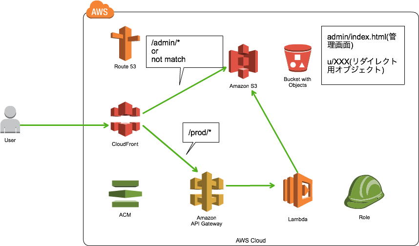
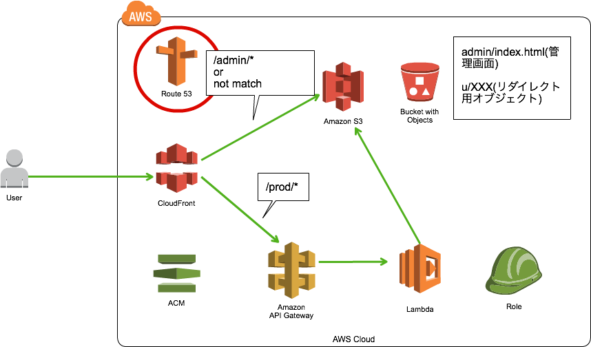
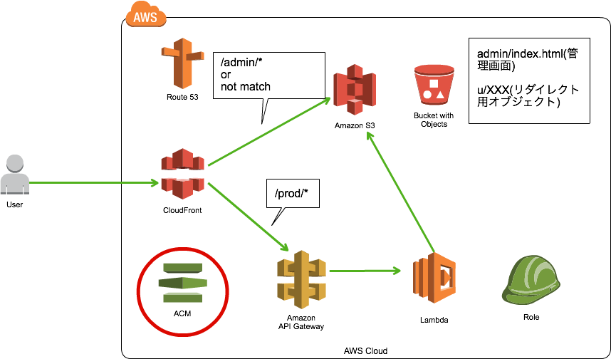
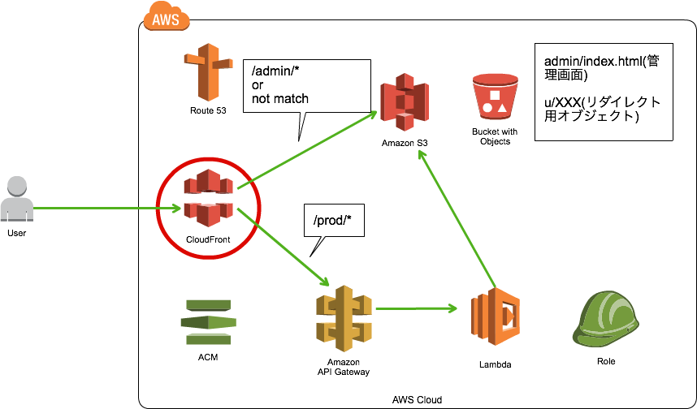
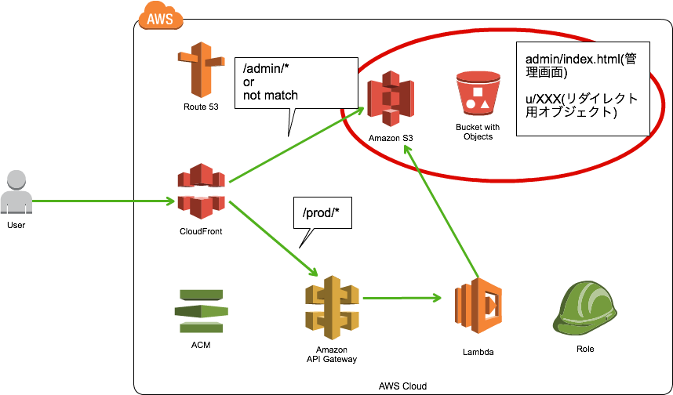
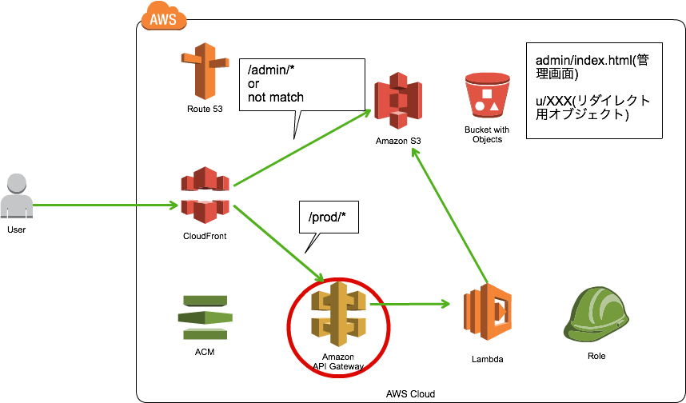
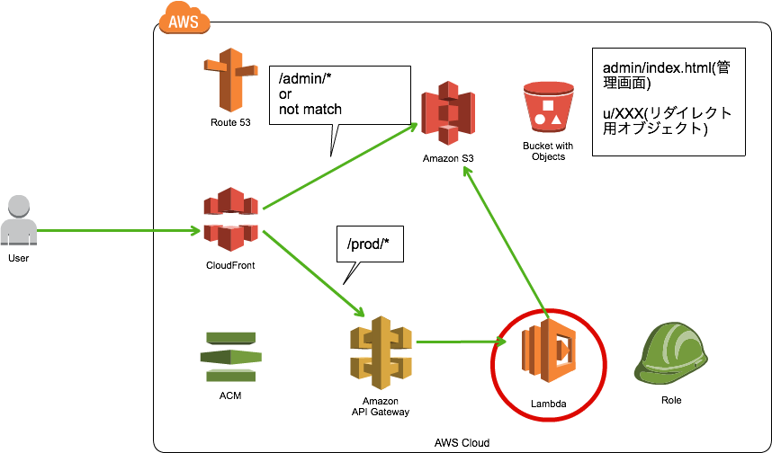
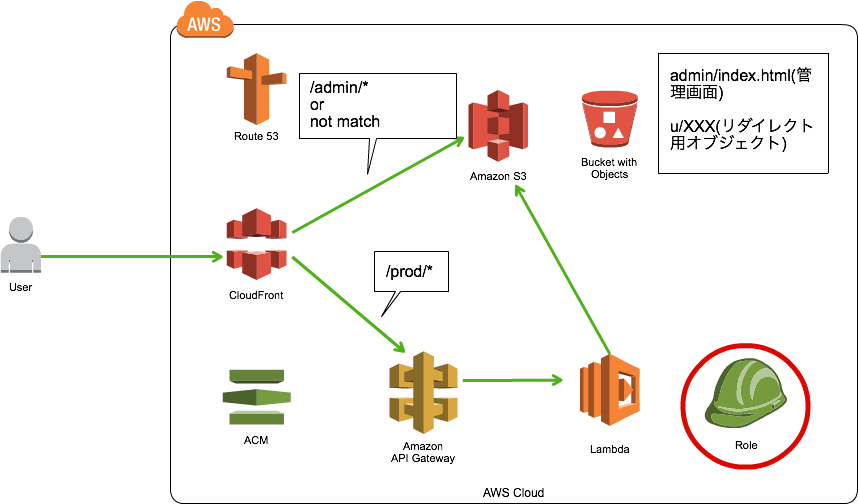
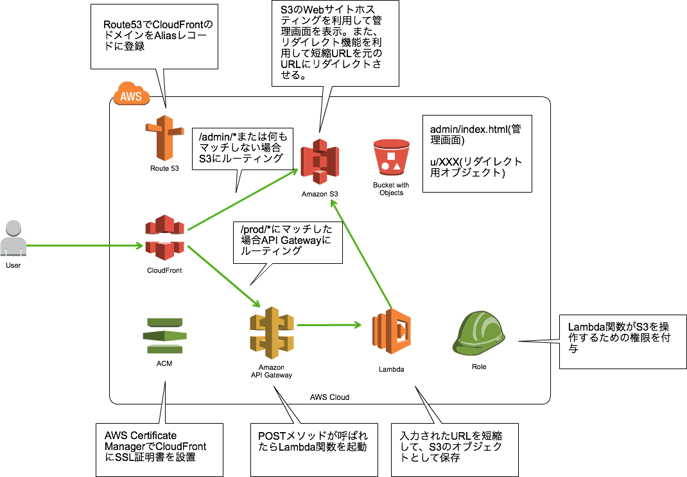
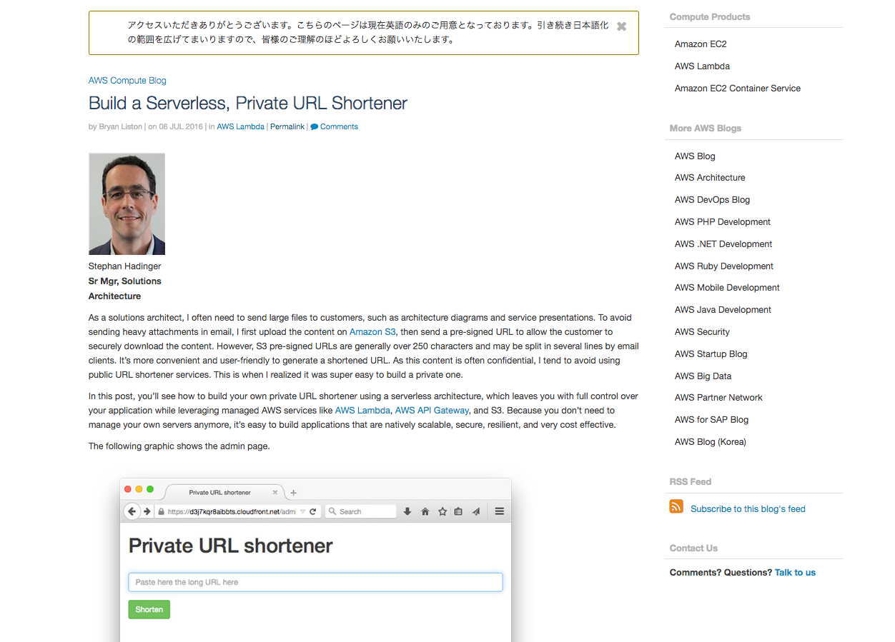

layout: true
class: center, middle

---
# サーバレスでURL短縮サービスを実装してみた
### 実践 AWSプログラミング<br/>in Osaka<br/>2016/08/30 中山 幸治

---
# 自己紹介

---
# 中山 幸治(knakayama)&nbsp;
### [https://knakayama.github.io](https://knakayama.github.io)
### 

---
# クラスメソッド<br/>AWSコンサルティング部<br/>所属

---
# 今日の資料↓に置いときました
### [https://github.com/knakayama/slide-2016-08-30](https://github.com/knakayama/slide-2016-08-30)
### [https://github.com/knakayama/serverless-url-shortener](https://github.com/knakayama/serverless-url-shortener)
### 「knakayama」とかでググれば出てくると思います

---
layout: true
class: center, middle

---
# アジェンダ

---
layout: true
class: middle

---
### 1. サーバレスアーキテクチャとは
### 2. URL短縮サービスの概要
### 3. TerraformによるAWSサービスのコード化
### 4. 利用した各種AWSサービスについて
### 5. Apexを利用したLambda関数のデプロイ
### 6. Demo
### 7. 元ネタ

---
layout: true
class: center, middle

---
# 1. サーバレスアーキテクチャとは

---
layout: true
class: middle

---
### - フルマネージドサービスを利用してサーバの管理を直接せずにシステムを構築する手法
### - 現時点ではAWSのサービスを組み合わせたシステムをこう呼ぶ場合がほとんど
### - イベントドリブンで処理を実行するためリソースを無駄なく効率的に利用できる

---
layout: true
class: center, middle

---
# 2. URL短縮サービスの概要

---
layout: true
class: middle

---
### - フォームにURL入力
### - 入力されたURLを短縮した文字列に変換して返す
### - 短縮されたURLでアクセスされたら元のURLを返す

---
layout: true
class: center, middle

---
# 3. TerraformによるAWSサービスのコード化

---
layout: true
class: middle

---
### - HashiCorpが中心となって開発している構成管理ツール
### - AWS/GCP/Azureなど主要なクラウドサービスに対応
### - 「リソース」という概念で利用サービスを定義
### - HCLという独自言語でリソースをコードとして管理できる

---
layout: true
class: center, middle

---
# 3. 利用した各種AWSサービスについて

---
### 全体構成図<br/><br/>

---
# Route53

---
### Route53<br/><br/>

---
layout: true
class: middle

---
### - CloudFrontのドメインをHosted ZoneのRecord Setに登録
### - CNAMEではなくAliasレコード(AWS独自レコード)で設定
### - XXX.cloudfront.net -> www.example.com

---
### &nbsp;&nbsp;&nbsp;&nbsp;&nbsp;&nbsp;&nbsp;&nbsp;&nbsp;&nbsp;&nbsp;&nbsp;&nbsp;&nbsp;&nbsp;&nbsp;&nbsp;&nbsp;&nbsp;&nbsp;&nbsp;&nbsp;&nbsp;&nbsp;&nbsp;&nbsp;&nbsp;&nbsp;&nbsp;&nbsp;Route53の設定

```bash
resource "aws_route53_zone" "dns" {
  name = "${var.domain_config["domain"]}"
}

resource "aws_route53_record" "cf" {
  zone_id = "${aws_route53_zone.dns.zone_id}"
  name    = "${var.domain_config["sub_domain"]}"
  type    = "A"

  alias {
    name                   = "${var.cf_domain_name}"
    zone_id                = "${var.cf_hosted_zone_id}"
    evaluate_target_health = false
  }
}
```

---
layout: true
class: center, middle

---
# ACM<br/>(AWS Certificate Manager)

---
### ACM<br/><br/>

---
layout: true
class: middle

---
### - 無料でSSL証明書を所得可能なサービス
### - CloudFrontのデフォルト証明書ではなく独自ドメインでSSL通信させるため
### - ドメイン認証のみ対応(EV SSL証明/企業実在証明にはならない)
### - 残念ながらまだ(2016/08/30)Terraformに対応してない
### - そのため手動で取得後、ACMのARNを参照している

---
### &nbsp;&nbsp;&nbsp;&nbsp;&nbsp;&nbsp;&nbsp;&nbsp;&nbsp;&nbsp;&nbsp;&nbsp;&nbsp;&nbsp;&nbsp;&nbsp;&nbsp;&nbsp;&nbsp;&nbsp;&nbsp;&nbsp;&nbsp;&nbsp;&nbsp;&nbsp;&nbsp;&nbsp;&nbsp;&nbsp;ACMの設定

```bash
resource "aws_cloudfront_distribution" "cf" {
<snip>
  viewer_certificate {
    acm_certificate_arn      = "${var.cf_config["acm_arn"]}"
    ssl_support_method       = "sni-only"
    minimum_protocol_version = "TLSv1"
  }
}
```

---
layout: true
class: center, middle

---
# CloudFront

---
### CloudFront<br/><br/>

---
layout: true
class: middle

---
### - 基本はCDN(Content Delivery Network)
### - L7レベルのルーティングに対応していたり機能は豊富
### - 今回キャッシュ目的ではなくURLルーティングするために使用

---
## Multi-Behavior
### - URLのパスに応じて特定のオリジンにトラフィックを振り分ける機能
### - `https://<hostname>/admin/*` or not match -> S3のバケット
### - `https://<hostname>/prod/` -> API Gateway

---
### &nbsp;&nbsp;&nbsp;&nbsp;&nbsp;&nbsp;&nbsp;&nbsp;&nbsp;&nbsp;&nbsp;&nbsp;&nbsp;&nbsp;&nbsp;&nbsp;&nbsp;&nbsp;&nbsp;&nbsp;&nbsp;&nbsp;&nbsp;&nbsp;CloudFrontの設定例(Origin)

```bash
resource "aws_cloudfront_distribution" "cf" {
  comment          = "${var.name}-cf"
  price_class      = "${var.cf_config["price_class"]}"
  aliases          = ["${var.domain_config["sub_domain"]}.${var.domain_config["domain"]}"]
  retain_on_delete = true
  enabled          = true
  origin {
    domain_name = "${var.s3_website_endpoint}"
    origin_id   = "OriginRedirect"
    origin_path = "/u"

    custom_origin_config {
      http_port              = 80
      https_port             = 443
      origin_protocol_policy = "http-only"
      origin_ssl_protocols   = ["TLSv1", "SSLv3"]
    }
  }
  origin {
    domain_name = "${var.s3_website_endpoint}"
    origin_id   = "OriginAdmin"

    custom_origin_config {
      http_port              = 80
      https_port             = 443
      origin_protocol_policy = "http-only"
      origin_ssl_protocols   = ["TLSv1", "SSLv3"]
<snip>
```

---
### &nbsp;&nbsp;&nbsp;&nbsp;&nbsp;&nbsp;&nbsp;&nbsp;&nbsp;&nbsp;&nbsp;&nbsp;&nbsp;&nbsp;&nbsp;&nbsp;&nbsp;&nbsp;&nbsp;&nbsp;&nbsp;&nbsp;&nbsp;CloudFrontの設定例(Behavior)

```bash
<snip>
  default_cache_behavior {
    allowed_methods        = ["GET", "HEAD"]
    cached_methods         = ["GET", "HEAD"]
    target_origin_id       = "OriginRedirect"
    viewer_protocol_policy = "redirect-to-https"
    min_ttl                = 0
    default_ttl            = 0
    max_ttl                = 0
    forwarded_values {
      query_string = false

      cookies {
        forward = "none"
      }
    }
  }

  cache_behavior {
    path_pattern           = "/admin/*"
    allowed_methods        = ["GET", "HEAD"]
    cached_methods         = ["GET", "HEAD"]
    target_origin_id       = "OriginAdmin"
    viewer_protocol_policy = "redirect-to-https"
    min_ttl                = 0
    default_ttl            = 0
    max_ttl                = 0
<snip>
```

---
layout: true
class: center, middle

---
# S3

---
### S3<br/><br/>

---
layout: true
class: middle

---
### - オブジェクトストレージ
### - イレブンナインの耐久性、スリーナインの可用性
### - Webホスティングも可能

---
## Javascript on S3
### - S3のWebホスティング機能では静的コンテンツ(html/css/js)が動作可能
### - 管理画面( `https://<hostname>/admin/index.html` )を表示させている

---
## リダイレクト機能
### - オブジェクトにアクセスしてきたら別のURLにリダイレクトさせる
### - このオブジェクトが短縮URLとしてユーザに利用される
### - `https://<hostname>/XXX` -> 実際のURLへリダイレクト

---
### &nbsp;&nbsp;&nbsp;&nbsp;&nbsp;&nbsp;&nbsp;&nbsp;&nbsp;&nbsp;&nbsp;&nbsp;&nbsp;&nbsp;&nbsp;&nbsp;&nbsp;&nbsp;&nbsp;&nbsp;&nbsp;&nbsp;&nbsp;&nbsp;&nbsp;&nbsp;&nbsp;&nbsp;&nbsp;&nbsp;&nbsp;&nbsp;&nbsp;S3の設定(バケット)

```bash
data "aws_iam_policy_document" "s3" {
  statement {
    sid    = "AddPerm"
    effect = "Allow"
    actions = [
      "s3:GetObject",
    ]
    resources = [
      "arn:aws:s3:::${random_id.s3.hex}/*",
    ]
    principals = {
      type = "AWS"

      identifiers = [
        "*",
      ]
    }
  }
}
resource "aws_s3_bucket" "s3" {
  bucket        = "${random_id.s3.hex}"
  acl           = "public-read"
  policy        = "${data.aws_iam_policy_document.s3.json}"
  force_destroy = true
  website {
    index_document = "${var.s3_config["index"]}"
  }
}
```

---
layout: true
class: center, middle

---
# API Gateway

---
### API Gateway<br/><br/>

---
layout: true
class: middle

---
### - ボタンポチポチ押すだけでAPIの作成ができるサービス
### - Lambdaの呼び出しに利用している

---
### - Terraformでコード化するとめちゃめちゃ長くなる。。。
### - APIが複雑な場合は別のフレームワーク使った方がいい気がする
#### - 1. `aws_api_gateway_rest_api` で元となるAPIを定義
#### - 2. `aws_api_gateway_method` でHTTPメソッドを作成
#### - 3. `aws_api_gateway_integration` でHTTPメソッドとLambda関数をひも付ける
#### - 4. `aws_api_gateway_method_response` でHTTPメソッドのステータスコードを定義
#### - 5. `aws_api_gateway_integration_response` でステータスコードとLambda関数をひも付ける
#### - 6. `aws_api_gateway_deployment` でAPI Gatewayをデプロイ
#### - 7. `aws_lambda_permission` でAPI GatewayからLambda関数を起動できるように設定

---
### &nbsp;&nbsp;&nbsp;&nbsp;&nbsp;&nbsp;&nbsp;&nbsp;&nbsp;&nbsp;&nbsp;&nbsp;&nbsp;&nbsp;&nbsp;&nbsp;&nbsp;&nbsp;&nbsp;&nbsp;&nbsp;&nbsp;&nbsp;&nbsp;&nbsp;&nbsp;&nbsp;&nbsp;&nbsp;&nbsp;&nbsp;&nbsp;&nbsp;API Gatewayの設定

```bash
resource "aws_api_gateway_rest_api" "api" {
  name        = "${var.name}"
  description = "${replace(var.name, "-", " ")}"
}
resource "aws_api_gateway_method" "api" {
  rest_api_id   = "${aws_api_gateway_rest_api.api.id}"
  resource_id   = "${aws_api_gateway_rest_api.api.root_resource_id}"
  http_method   = "POST"
  authorization = "NONE"
}
resource "aws_api_gateway_integration" "api" {
  rest_api_id             = "${aws_api_gateway_rest_api.api.id}"
  resource_id             = "${aws_api_gateway_rest_api.api.root_resource_id}"
  http_method             = "${aws_api_gateway_method.api.http_method}"
  type                    = "AWS"
  uri                     = "arn:aws:apigateway:${var.aws_region}:lambda:path/2015-03-31/functions/${var.lambda_arn}/invocations"
  integration_http_method = "POST"
}
resource "aws_api_gateway_method_response" "api" {
  rest_api_id = "${aws_api_gateway_rest_api.api.id}"
  resource_id = "${aws_api_gateway_rest_api.api.root_resource_id}"
  http_method = "${aws_api_gateway_method.api.http_method}"
  status_code = 200
}
<snip>
まだまだ続くよ！
```

---
layout: true
class: center, middle

---
# Lambda

---
### Lambda<br/><br/>

---
layout: true
class: middle

---
### - 何らかのイベントによって(イベントドリブン)コンテナが起動し、その中でコードを実行するという仕組み
### - 必要なときのみ起動するので、EC2などと比べてコスト効率がよい
### - サーバレスアーキテクチャの中心となるサービス
### - 入力されたURLから短縮した文字列を生成しS3にオブジェクトを作成している

---
### &nbsp;&nbsp;&nbsp;&nbsp;&nbsp;&nbsp;&nbsp;&nbsp;&nbsp;&nbsp;&nbsp;&nbsp;&nbsp;&nbsp;&nbsp;Lambda関数のコード(オブジェクトの作成)

```python
def check_and_create_s3_redirect(s3_bucket, key_short, url_long, cdn_prefix, id_short):
    client = boto3.client("s3")

    try:
        # すでにオブジェクトが存在しているか
        client.head_object(Bucket=s3_bucket, Key=key_short)
    except Exception as e:
        err_msg = e.response["Error"]["Message"]

        if err_msg == "Not Found":
            try:
                # オブジェクトが存在していない場合は作成
                client.put_object(
                    Bucket=s3_bucket,
                    Key=key_short,
                    Body="",
                    WebsiteRedirectLocation=url_long, # 元のURLをメタデータに登録
                    ContentType="text/plan"
                    )
            except Exception as e:
                # オブジェクトの作成に失敗したらエラーメッセージをJSONで返す
                return done(url_long, "", err_msg)
            else:
                ret_url = "https://" + cdn_prefix + "/" + id_short
                print("Success, short_url = {}".format(ret_url))
                # オブジェクトの作成が成功したら短縮URLをJSONで返す
                return done(url_long, ret_url)
<snip>
```

---
layout: true
class: center, middle

---
# IAM

---
### IAM<br/><br/>

---
layout: true
class: middle

---
### - AWSサービス間の権限を制御する仕組み
### - LambdaにCloudWatch LogsとS3へのアクセス権を付与

---
### &nbsp;&nbsp;&nbsp;&nbsp;&nbsp;&nbsp;&nbsp;&nbsp;&nbsp;&nbsp;&nbsp;&nbsp;&nbsp;&nbsp;&nbsp;&nbsp;&nbsp;&nbsp;&nbsp;&nbsp;&nbsp;&nbsp;&nbsp;&nbsp;&nbsp;&nbsp;&nbsp;&nbsp;&nbsp;&nbsp;&nbsp;&nbsp;&nbsp;&nbsp;&nbsp;&nbsp;IAMの設定

```bash
resource "aws_iam_role" "lambda_function" {
  name               = "${var.name}-role"
  assume_role_policy = "${file("${path.module}/policy/lambda_assume_role_policy.json")}"
}

resource "aws_iam_policy_attachment" "cloudwatch_full_access" {
  name       = "CloudWatchFullAccess"
  roles      = ["${aws_iam_role.lambda_function.name}"]
  policy_arn = "arn:aws:iam::aws:policy/CloudWatchFullAccess"
}

resource "aws_iam_policy_attachment" "s3_full_access" {
  name       = "S3FullAccess"
  roles      = ["${aws_iam_role.lambda_function.name}"]
  policy_arn = "arn:aws:iam::aws:policy/AmazonS3FullAccess"
}
```
---
layout: true
class: center, middle

---
### 全体構成図(詳細)<br/><br/>


---
layout: true
class: center, middle

---
# 5. Apexを利用したLambda関数のデプロイ

---
layout: true
class: middle

---
### - Lambda関数のデプロイを手動でやるのは結構面倒くさい(コードのzip化、権限の付与など)
### - そのへんをCLIでまるっとやってくれるのがApex
### - 内部的にTerraformを呼び出せるので全てのリソースをコードとして管理できる
### - ローカルでLambda関数をテストできる

---
### &nbsp;&nbsp;&nbsp;&nbsp;&nbsp;&nbsp;&nbsp;&nbsp;&nbsp;&nbsp;&nbsp;&nbsp;&nbsp;&nbsp;&nbsp;&nbsp;&nbsp;&nbsp;&nbsp;&nbsp;&nbsp;&nbsp;&nbsp;&nbsp;&nbsp;&nbsp;&nbsp;&nbsp;&nbsp;&nbsp;Apexのディレクトリ構造

```bash
serverless-url-shortener/
├── README.md
├── functions # Lambda関数格納ディレクトリ
│   └── serverless_url_shortener
│       └── main.py
├── infrastructure
│   ├── modules # 各種リソース格納ディレクトリ
│   │   ├── api_gateway
│   │   │   └── <snip>
│   │   ├── cloudfront
│   │   │   └── <snip>
│   │   ├── dns
│   │   │   └── <snip>
│   │   ├── iam
│   │   │   └── <snip>
│   │   └── s3
│   │       └── <snip>
│   └── prod # Terraformの大本のファイル
│       ├── main.tf
│       ├── outputs.tf
│       ├── secret.tfvars
│       └── variables.tf
└── project.json # Apexデプロイ用ファイル
```

---
### &nbsp;&nbsp;&nbsp;&nbsp;&nbsp;&nbsp;&nbsp;&nbsp;&nbsp;&nbsp;&nbsp;&nbsp;&nbsp;&nbsp;&nbsp;&nbsp;&nbsp;&nbsp;&nbsp;&nbsp;&nbsp;&nbsp;&nbsp;Apexの設定ファイル(project.json)

```json
{
  "name": "serverless-url-shortener",
  "description": "serverless url shortener",
  "nameTemplate": "{{.Function.Name}}",
  "memory": 128,
  "timeout": 10,
  "runtime": "python",
  "defaultEnvironment": "prod",
  "environment": {
    "S3Bucket": "_YOUR_BUCKET_",
    "S3Prefix": "u"
  }
}
```

---
### &nbsp;&nbsp;&nbsp;&nbsp;&nbsp;&nbsp;&nbsp;&nbsp;&nbsp;&nbsp;&nbsp;&nbsp;&nbsp;&nbsp;&nbsp;&nbsp;&nbsp;&nbsp;&nbsp;&nbsp;&nbsp;&nbsp;&nbsp;&nbsp;&nbsp;&nbsp;&nbsp;&nbsp;&nbsp;&nbsp;Apexの主要なコマンド

```bash
# Lambda関数のデプロイ
$ apex deploy <lambda> --dry-run
$ apex deploy <lambda> --set S3Bucket=<_YOUR_BUCKET_>
# Terraformの実行
$ apex infra plan
$ apex infra apply
# Lambda関数の起動
$ apex invoke <lambda>
$ apex invoke <lambda> --logs
$ cat test.json | apex invoke <lambda> --logs
# CloudWatch Logsの表示
$ apex logs <lambda>
$ apex logs <lambda> --follow
# Lambda関数の削除
$ apex delete <lambada>
```

---
layout: true
class: center, middle

---
# 6. Demo

---
# 7. 元ネタ

---
layout: true
class: center, middle

---

#### https://aws.amazon.com/jp/blogs/compute/build-a-serverless-private-url-shortener

---
layout: true
class: center, middle

---
# Stephanさんありがとう！

---
layout: true
class: middle

---
## 元ネタとの違い
### - Cloudformation -> Terraform
### - LambdaのデプロイをApexに変更
### - Node.js -> Python

---
layout: true
class: center, middle

---
# Stephanさんありがとう！

---
layout: true
class: center, middle

---
# おわり
